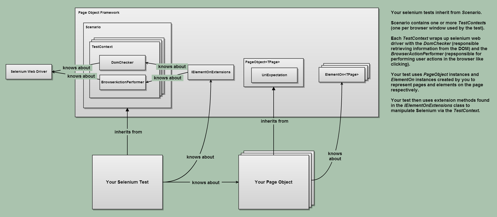

NPageObject
=====



A page object framework for .NET. Page objects promote locality of reference, DRY-up your acceptance tests and reduce brittleness. It makes your code more maintainable.

Example of use:

```C#

public class LoginPage : PageObject<LoginPage>
{       
	public override UriExpectation UriExpectation {
		get { return new UriExpectation { UriContentsRelativeToRoot = "/", Match = UriMatch.Exact }; }
	}

	public override string IdentifyingText { get { return "Example identifying text" } }

	public IElementOn<LoginPage> UsernameTextField 	{
		get { return new ElementOn<LoginPage>(Context, selector: "#username"); }
	}

	public IElementOn<LoginPage> PwdTextField {
		get { return new ElementOn<LoginPage>(Context, selector: "#password"); }
	}

	public IElementOn<LoginPage> LoginButton {
		get { return new ElementOn<LoginPage>(Context, selector: "#loginButton"); }
	}
}


[TestClass]
public class ExampleTest
{
	private SeleniumUITestContext<LoginPage> _context;

	[SetUp]
	public void Setup() { /* ... */ }

	[TestMethod]
	public void GivenAValidUser_WhenIEnterCredentialsAndClickLogin_ThenIAmLoggedIn()
	{
		var page = _context.NavigateTo<LoginPage>()
							  .UsernameTextField
							  .InputText("username")
							  .PwdTextField
							  .InputText("password")
							  .LoginButton
							  .ClickWithNavigation<HomePage>();

		Assert.That(page.MatchesActualBrowserLocation());
	}
}


```

If NPageObject helps you or your team develop great software please [let me know](mailto:ben@bj.ma "Ben's email address")! It will help motivate me to develop and improve NPageObject.


How to use:
--------
**-1. Check the target framework of your application**

It *must* be ```.NET Framework 4``` (*not* the ```Client Profile``` version - or you might get strange compilation errors.)


**0. Get it**

```shell
	nuget install npageobject	
```

**1. Define a page object**

For example:

```C#

public class LoginPage : PageObject<LoginPage>
{       
	public override UriExpectation UriExpectation {
		get { return new UriExpectation { UriContentsRelativeToRoot = "/", Match = UriMatch.Exact }; }
	}

	public override string IdentifyingText { get { return "Example identifying text" } }

	public IElementOn<LoginPage> UsernameTextField 	{
		get { return new ElementOn<LoginPage>(Context, selector: "#username"); }
	}

	public IElementOn<LoginPage> PwdTextField {
		get { return new ElementOn<LoginPage>(Context, selector: "#password"); }
	}

	public IElementOn<LoginPage> LoginButton {
		get { return new ElementOn<LoginPage>(Context, selector: "#loginButton"); }
	}
}

```


**2. Initialize NPageObject in your test setup**

For example:

```C#

[TestClass]
public class ExampleTest
{
	private SeleniumUITestContext<LoginPage> _context;

	[SetUp]
	public void Setup() { 
		var driver = new ChromeDriver();
		var domChecker = new SeleniumDomChecker(driver, 5.Seconds());
		var browserActionPerformer = new SeleniumBrowserActionPerformer(driver, 
																		domChecker,
																		isInDemonstrationMode: false, //slows down UI actions for demonstrations
																		uriRoot: "www.example.com", 
																		elementSelectionTimeout: 5.Seconds());
		_context = new SeleniumUITestContext<LoginPage>(driver,
														browserActionPerformer,
														domChecker,
														uriRoot: "www.example.com");
	}
}

```


**3. Write your test, optionally using one of the provided custom NUnit constraints**

For example:

```C#

	[Test]
	public void GivenAValidUser_WhenIEnterCredentialsAndClickLogin_ThenIAmLoggedIn()
	{
		var page = _context.BrowseTo<LoginPage>()
							  .UsernameTextField
							  .InputText("sdkubdf")
							  .PwdTextField
							  .InputText("password")
							  .LoginButton
							  .ClickWithNavigation<HomePage>();

		Assert.That(page.MatchesActualBrowserLocation());
	}
	
```

How to build and/or run the tests:
--------

1. Run `/build/build.bat`
1. Type in the desired option
1. Hit return

License & Copyright
--------

This software is released under the GNU Lesser GPL. It is Copyright 2012, Ben Aston. I may be contacted at ben@bj.ma.

How to Contribute
--------

Pull requests including bug fixes, new features and improved test coverage are welcomed. Please do your best, where possible, to follow the style of code found in the existing codebase.
